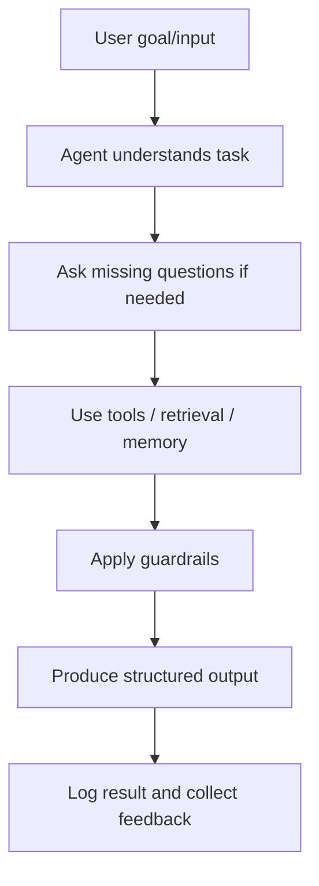
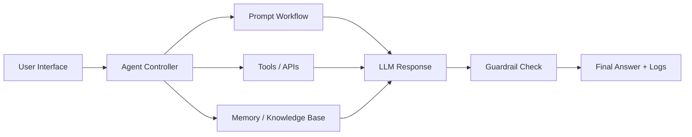

# Public Scheme Eligibility Assistant

## Project Details

**Track:** AAI  
**Difficulty Level:** Basic + Intermediate  
**Domain:** Public welfare access  
**Recommended Duration:** 10 Days  
**Mode:** Individual or Group of 3-4 Students  

---

## Project Overview

Citizens often miss welfare schemes because eligibility rules are difficult to understand. Build an agent that asks user details, matches them with scheme rules from a knowledge base, and lists next documents/actions.

---

## Real-World Impact

This project creates a practical AI assistant for a real user need while keeping humans in control for sensitive decisions.

---

## Problem Statement

Build a working solution for **Public Scheme Eligibility Assistant** that takes relevant input data, processes it through a clear workflow, and produces an actionable output for real users or decision-makers.

The solution should not stop at code execution. It should help a user understand what action to take next.

---

## AI / Innovation Component

Scheme RAG, eligibility matching, missing-doc checklist, multilingual/simple explanation option.

Students should clearly explain where AI/ML/agent logic is used and why it is useful for the problem.

---

## Dataset / Reference Source

**Dataset / Reference Name:** myScheme Government Portal

**Link:** https://www.myscheme.gov.in/

**How to Use It:**
Use selected public scheme descriptions as reference documents; create scheme_rules.csv for eligibility logic.

**Target / Output Field:**
Agent output quality, risk score, routing decision, checklist, or structured response

If access to the dataset is difficult, create a smaller sample CSV with similar columns and clearly mention that it is synthetic starter data.


## Recommended Tools and Technologies

Python, LLM API, prompt templates, JSON outputs, SQLite/CSV memory, optional vector store, Streamlit/Gradio, logging

Use simple tools first. Advanced tools are optional only after the basic workflow is complete.

---

## Project Flow



---

## System / Pipeline Architecture



---

## Core Modules to Build

- User input form
- Prompt workflow
- Tool/function layer
- Memory or retrieval
- Guardrails and fallback
- Logs/evaluation sheet

---

## Minimum Expected Work

Students must complete:

1. Problem understanding and user/stakeholder explanation
2. Data/reference material preparation
3. Basic working workflow
4. AI/ML/agent/software logic implementation
5. Output explanation in simple English
6. Validation using metrics, test cases, or scenario checks
7. Documentation, presentation, and demo video

---

## Suggested 10-Day Execution Plan

### Day 1: Understand the problem and users
- Read the problem statement
- Identify users, inputs, outputs, and success criteria
- Review dataset/reference/source material

### Day 2: Prepare data or source material
- Download/create data
- Clean and inspect fields
- Prepare starter records or knowledge base

### Day 3: Build baseline workflow
- Create initial notebook, backend, or agent flow
- Implement the simplest working version

### Day 4: Add core logic
- Add model/analysis/tool/API/database logic
- Validate outputs using sample cases

### Day 5: Add AI/ML/agent feature
- Implement the AI component
- Ensure output is structured and understandable

### Day 6: Improve and evaluate
- Compare outputs
- Add metrics, test cases, or quality checks
- Fix errors and edge cases

### Day 7: Build prototype/demo UI
- Create Streamlit, frontend, CLI, or dashboard
- Connect input to final output

### Day 8: Add guardrails and explanations
- Add limitations, fallback responses, and responsible-use notes
- Add interpretation/explanation section

### Day 9: Documentation and presentation
- Complete README
- Prepare PPT/report
- Clean code and folder structure

### Day 10: Final demo and submission
- Record demo video
- Final check of GitHub repo
- Submit files and links

---

## Required Deliverables

1. GitHub repository
2. Dataset/reference/source file or link
3. Code files/notebooks
4. README file
5. Project documentation/report
6. Presentation PPT/PDF
7. Demo video
8. Requirements file if using extra libraries
9. Screenshots of working prototype
10. Notes on limitations and responsible use

---

## Suggested Repository Structure

```text
public_scheme_eligibility_assistant/
│
├── data/
│   └── sample_or_raw_data.csv
│
├── notebooks/
│   └── exploration_or_modeling.ipynb
│
├── src/
│   ├── main.py
│   ├── preprocessing.py
│   └── utils.py
│
├── app/
│   └── app.py
│
├── docs/
│   ├── project_report.md
│   └── presentation.pdf
│
├── requirements.txt
└── README.md
```

For beginner students, a clean notebook or Streamlit app is acceptable. Stronger teams can use a full folder structure.

---

## README Structure

The README should include:

1. Project title
2. Problem statement
3. Dataset/reference source
4. Tools used
5. Project workflow
6. AI/ML/agent/software component
7. How to run the project
8. Demo screenshots
9. Results and insights
10. Limitations
11. Future improvements
12. Team member names

---

## Presentation Structure

Prepare 8-10 slides:

1. Title and team
2. Problem and real-world impact
3. Dataset/reference/source material
4. System workflow
5. AI/ML/agent/software innovation
6. Prototype/demo screenshots
7. Results or sample outputs
8. Limitations and responsible use
9. Future improvements
10. Final conclusion

---

## Demo Video Expectations

The demo video should be 5-8 minutes and should show:

1. What problem you solved
2. Who the users are
3. What data/source material you used
4. How the system works
5. Where AI/ML/agent/software logic is used
6. Sample input and output
7. Limitations and improvements

---

## Minimum Acceptance Criteria

1. Problem statement and real-world impact clearly explained
2. Dataset/reference/source material used correctly
3. Clean workflow from input to final output
4. AI/ML/agent/software component implemented meaningfully
5. Clear evaluation or validation method included
6. README, documentation, presentation, and demo video completed
7. Limitations and responsible-use notes mentioned
8. Guardrails/fallback logic included
9. Logs of agent steps or sample scenarios included

---

## Common Mistakes to Avoid

- Building only a notebook without explaining the real-world use
- Adding AI only for decoration without a clear purpose
- Copy-pasting code or datasets without understanding
- Not validating the output
- Not mentioning limitations
- Submitting without README or demo video
- Making unsafe claims in sensitive domains
